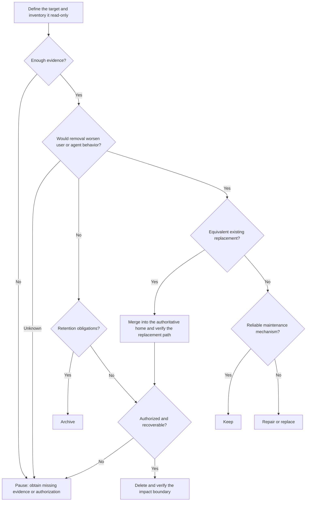

# Da Sao Chu (大扫除)

[English](README.md) | [简体中文](README.zh-CN.md)

A skill that helps AI agents decide what to do with code, modules, files, documents, and mechanisms.

<p align="center">
  
  <br />
  <sub><em>Da sao chu</em> (大扫除, literally “big cleaning”) is a familiar Chinese practice of doing a thorough, collective clean-up—at home, at school, or before a fresh start—to clear away clutter, reset a shared space, and begin again with intention.</sub>
</p>

## The problem

AI agents make creation cheap. Repositories can quickly accumulate:

- Modules, documents, and mechanisms that duplicate the same responsibility.
- Manual copies, forwarding layers, and synchronization mechanisms alongside authoritative sources.
- Hidden consumers, historical evidence, and retention obligations that make deletion difficult to assess.

Each addition creates another maintenance path. People and agents have a harder time deciding what still provides value.

## Why it happens

- **Scattered usage evidence:** consumers, triggers, input contracts, outputs, and retention obligations lack a shared view.
- **Weak criteria for duplication:** filenames and directory layouts stand in for verified responsibilities and observable behavior.
- **Unclear authority:** sources of truth, projections, and adapters are mixed together, making every copy seem essential.
- **Missing deletion impact analysis:** few reviews ask, “Would removing this make things worse for a user or agent?”

## The approach

`da-sao-chu` turns cleanup into an auditable decision process:

1. Break complex targets into [responsibility atoms](skills/da-sao-chu/references/responsibility-atom.md): complete, non-overlapping units that can be assessed, acted on, and verified independently.
2. Define the permissions and impact boundary for each atom.
3. Inventory responsibilities, consumers, triggers, dependencies, outputs, and retention obligations using read-only checks.
4. Assess value through responsibilities, behavior, and the consequences of removal.
5. Identify the authoritative home and recommend deletion, archiving, merging, repair, retention, or a pause.
6. Obtain authorization for the specific action, confirm recovery, execute, and verify consumer behavior.

Core safety principle: **unknown usage does not mean unused.** Pause when evidence or permissions are insufficient, or unresolved irreversible risks remain.

## Decision tree



The tree guides the recommendation. Its merge and archive nodes remain subject to authorization and recovery checks before execution.

## Installation

```bash
git clone https://github.com/zhaidewei/da-sao-chu.git
cd da-sao-chu
./scripts/install.sh both
```

Replace `both` with `codex` or `claude` to install for one tool. The script refuses to overwrite an existing installation.

### Install through the Codex Skill Installer

```text
Use $skill-installer to install skills/da-sao-chu from zhaidewei/da-sao-chu.
```

## Usage

```text
Use $da-sao-chu to assess whether this module is worth keeping.
/da-sao-chu Review this duplicated configuration mechanism and propose a cleanup plan.
```

See [`skills/da-sao-chu/SKILL.md`](skills/da-sao-chu/SKILL.md) for the full instructions. The skill and its bundled reference are in English.

## License

[MIT](LICENSE)
