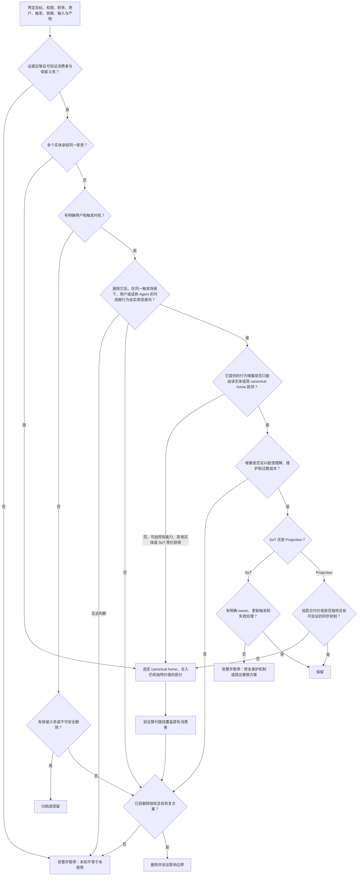

# 大扫除（da-sao-chu）

一个帮助 AI Agent 判断代码、模块、文件、文档和机制该如何处置的 Skill。

<p align="center">
  
  <br />
  <sub><em>Da sao chu</em> (大扫除, literally “big cleaning”) is a familiar Chinese practice of doing a thorough, collective clean-up—at home, at school, or before a fresh start—to clear away clutter, reset a shared space, and begin again with intention.</sub>
</p>

## 问题 / 麻烦

AI Agent 让“造一个新的”变得非常便宜，也让代码库更容易积累东西：

- 多个模块、文档或机制承担相同职责，却各自继续演化。
- 已经有权威来源，旁边仍保留着手工复制、转发或同步出来的版本。
- 某个资产看起来没人使用，但真实消费者可能藏在动态调用、自动化任务或其他权限边界里。
- 团队知道有些东西应该清理，却担心误删依赖、历史证据或合规要求。
- “先留着，也许以后有用”不断增加理解成本、维护路径和过期风险。

结果是：Agent 能继续产出，却越来越难判断哪些东西仍然有价值，哪些只是在消耗注意力。

## 根因

- **创建收益立即可见，删除风险滞后出现。** 新增功能容易验收，清理工作的价值常常要到未来才显现。
- **使用证据分散。** 调用者、触发时机、输入契约、输出语义和保留义务很少集中在一个地方。
- **按名字和目录判断重复。** 真正的重复来自职责与可观察行为；文件名和目录结构只能作为线索。
- **权威归属不清楚。** SoT、Projection 和 Adapter 混在一起后，每份副本都像“不能删”。
- **缺少删除反事实。** 团队很少明确追问：删掉它后，在相同场景中，用户或 Agent 的行为到底会不会变差？
- **证据不足被误读成没有价值。** 未知消费者、权限不足和无法验证的依赖都可能造成危险误判。

## 对策

`da-sao-chu` 把清理变成一套可审计的处置过程：

1. 先界定一个清晰目标，以及允许检查和修改的边界。
2. 只读盘点职责、用户、触发、依赖、输入、产物和保留义务。
3. 按职责与行为识别同类项，选择 canonical home，并保留真正独特的价值。
4. 使用删除反事实检验它是否改变用户或成熟 Agent 的可观察行为。
5. 区分 SoT、Projection 和 Adapter，检查 owner、同步、漂移检测与失效处理。
6. 在删除、归档、合并、修复、保留和“告警并暂停”之间给出有证据的结论。
7. 只有在获得明确授权且具备恢复方案后才执行删除，并在执行后验证影响边界。

核心安全原则：**未知不等于未使用。** 证据不足、权限不足或不可逆风险尚未解决时，应当暂停并等待证据补齐。

## 决策树



## 适用工具

- OpenAI Codex
- Claude Code
- 其他兼容 `SKILL.md` 的 Agent 工具

Skill 源文件位于 [`skills/da-sao-chu/SKILL.md`](skills/da-sao-chu/SKILL.md)。

## 安装

先克隆仓库：

```bash
git clone https://github.com/zhaidewei/da-sao-chu.git
cd da-sao-chu
```

安装到 Codex：

```bash
./scripts/install.sh codex
```

安装到 Claude Code：

```bash
./scripts/install.sh claude
```

同时安装：

```bash
./scripts/install.sh both
```

脚本不会覆盖既有安装。若目标目录已经存在，它会停止并要求你先自行处理旧版本。

### 在 Codex 中通过 Skill Installer 安装

也可以让 Codex 执行：

```text
使用 $skill-installer 从 zhaidewei/da-sao-chu 的 skills/da-sao-chu 安装
```

安装后，新 Skill 会在下一轮对话中可用。

## 使用

直接描述清理目标，例如：

```text
用 $da-sao-chu 检查这个模块是否值得保留。
```

在 Claude Code 中也可以显式调用：

```text
/da-sao-chu 清理这套重复的配置机制
```

## License

[MIT](LICENSE)
