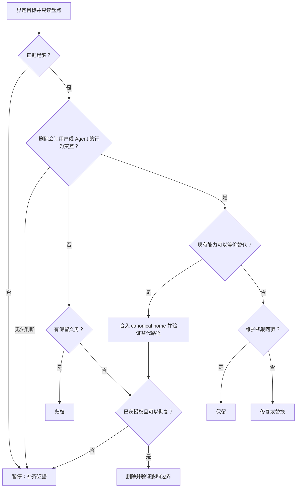

# 大扫除（da-sao-chu）

一个帮助 AI Agent 判断代码、模块、文件、文档和机制该如何处置的 Skill。

<p align="center">
  
  <br />
  <sub><em>Da sao chu</em> (大扫除, literally “big cleaning”) is a familiar Chinese practice of doing a thorough, collective clean-up—at home, at school, or before a fresh start—to clear away clutter, reset a shared space, and begin again with intention.</sub>
</p>

## 问题 / 麻烦

AI Agent 让创建变得很便宜，也让代码库更容易积累东西：

- 同一职责被多个模块、文档或机制重复承担。
- 权威来源旁边长期保留手工副本、转发层和同步机制。
- 隐藏消费者、历史证据和保留义务让团队不敢删除。

结果是维护路径持续增加，Agent 和人都更难判断什么仍有价值。

## 根因

- **使用证据分散：** 调用者、触发时机、输入契约、产物和保留义务缺少统一视图。
- **判断标准失焦：** 文件名和目录结构被当成重复证据，职责与可观察行为反而没有验证。
- **权威归属不清：** SoT、Projection 和 Adapter 混在一起，每份副本都像“不能删”。
- **缺少删除反事实：** 很少有人追问“删掉它后，用户或 Agent 的行为会不会变差？”

## 对策

`da-sao-chu` 把清理变成一套可审计的决策过程：

1. 按 [`责任原子`](skills/da-sao-chu/references/responsibility-atom.md) 将复杂目标拆成不重不漏、可独立处置和验证的责任单元。
2. 界定每个责任原子的权限和影响边界。
3. 只读盘点职责、消费者、触发、依赖、产物和保留义务。
4. 用职责、行为和删除反事实判断真实价值。
5. 识别 canonical home，给出删除、归档、合并、修复、保留或暂停结论。
6. 获得授权并确认恢复方案后执行，随后验证消费者行为。

核心安全原则：**未知不等于未使用。** 证据不足、权限不足或不可逆风险尚未解决时，应当暂停并等待证据补齐。

## 决策树



## 安装

```bash
git clone https://github.com/zhaidewei/da-sao-chu.git
cd da-sao-chu
./scripts/install.sh both
```

将 `both` 换成 `codex` 或 `claude` 可以只安装到一个工具。脚本不会覆盖既有安装。

### 在 Codex 中通过 Skill Installer 安装

```text
使用 $skill-installer 从 zhaidewei/da-sao-chu 的 skills/da-sao-chu 安装
```

## 使用

```text
用 $da-sao-chu 检查这个模块是否值得保留。
/da-sao-chu 清理这套重复的配置机制
```

完整规则见 [`skills/da-sao-chu/SKILL.md`](skills/da-sao-chu/SKILL.md)。

## License

[MIT](LICENSE)
