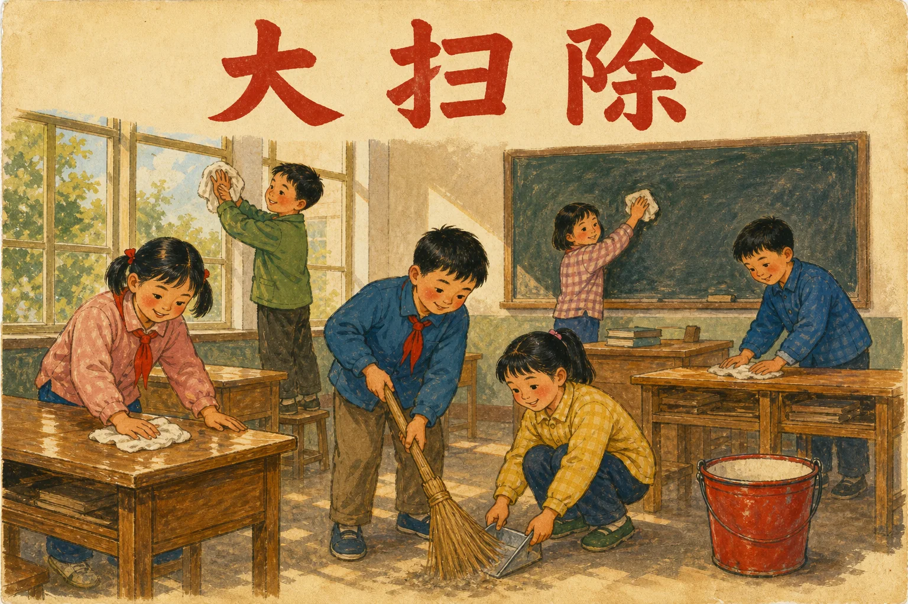

# 大扫除（da-sao-chu）

一个用于清理代码、模块、文件、文档和机制的 Agent Skill。

它先识别职责重复，再用“删除后会发生什么”检验一个实体是否真正改变用户或 Agent 的可观察行为，最后结合 SoT、Projection 和维护机制决定删除、归档、合并、告警或保留。

<p align="center">
  
  <br />
  <sub><em>Da sao chu</em> (大扫除, literally “big cleaning”) is a familiar Chinese practice of doing a thorough, collective clean-up—at home, at school, or before a fresh start—to clear away clutter, reset a shared space, and begin again with intention.</sub>
</p>

## 适用工具

- OpenAI Codex
- Claude Code
- 其他兼容 `SKILL.md` 的 Agent 工具

Skill 源文件位于 [`skills/da-sao-chu/SKILL.md`](skills/da-sao-chu/SKILL.md)。

## 安装

先克隆仓库：

```bash
git clone https://github.com/zhaidewei/da-sao-chu.git
cd da-sao-chu
```

安装到 Codex：

```bash
./scripts/install.sh codex
```

安装到 Claude Code：

```bash
./scripts/install.sh claude
```

同时安装：

```bash
./scripts/install.sh both
```

脚本不会覆盖既有安装。若目标目录已经存在，它会停止并要求你先自行处理旧版本。

### 在 Codex 中通过 Skill Installer 安装

也可以让 Codex 执行：

```text
使用 $skill-installer 从 zhaidewei/da-sao-chu 的 skills/da-sao-chu 安装
```

安装后，新 Skill 会在下一轮对话中可用。

## 使用

直接描述清理目标，例如：

```text
用 $da-sao-chu 检查这个模块是否值得保留。
```

在 Claude Code 中也可以显式调用：

```text
/da-sao-chu 清理这套重复的配置机制
```

## 设计原则

- 按职责和行为判断重复，不按名字判断。
- 用删除反事实检验真实价值。
- 未知不等于未使用；证据不足、权限不足或风险无法恢复时暂停。
- 删除前需要明确授权、恢复方案和保留义务检查。
- 先确定 canonical home，再迁移独特价值。
- 区分 SoT 与 Projection，并检查维护和同步机制。
- 权限、区域、生命周期或契约不同的实体保留边界。

## License

[MIT](LICENSE)
