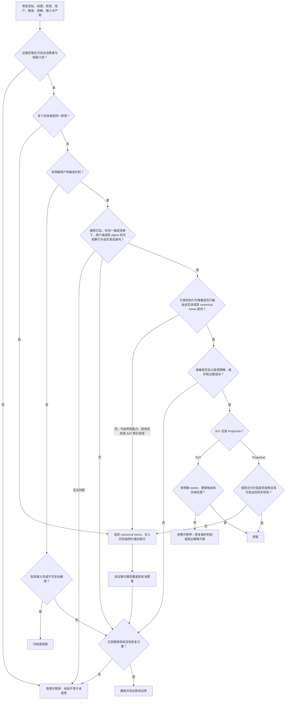

未知用户、动态调用、权限不足或缺失证据都不等于未使用。先做只读盘点；涉及删除、覆盖、远程状态或不可逆变更时，必须取得与目标和范围匹配的明确授权。执行删除前确认恢复方式、保留义务和影响边界，删除后验证预期消费者行为，并报告仍无法证明的部分。

同类项按职责和行为判定，不按名字或表面结构判定。只有在用户、触发时机、输入契约和产物语义兼容时才合并；区域、生命周期或权限边界不同且具有独立语义的实体应保留分离。合并时先选择一个权威归属，迁入各实现仍被使用的独特价值，再删除其余重复内容和并行维护机制；不得以抽象化为由保留仅做转发、复述或同步复制的中间层。
