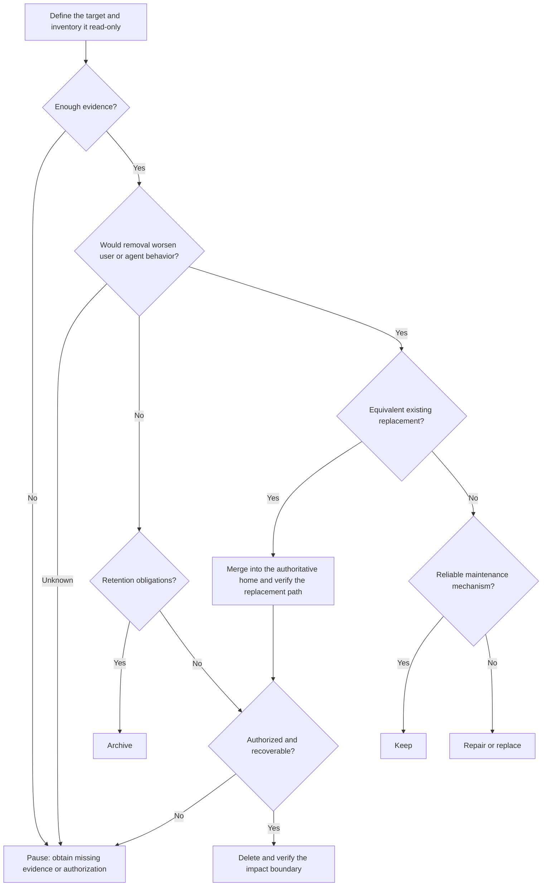

## Preparation

For a complex target, first read [Responsibility Atom](references/responsibility-atom.md) and produce a complete, non-overlapping decomposition into responsibility atoms that can be acted on and verified independently. Pass each established atom through the decision tree below. A `HOLD` outcome has not yet established an actionable unit.

## Decision tree

## Safety

Missing usage evidence does not prove that something is unused. Pause when evidence is insufficient. This skill produces a disposition plan; deletion, overwriting, or merging requires user authorization for the specific target, followed by impact verification. Before executing a change, confirm the recovery method, retention obligations, and impact boundary. The tree's archive and merge nodes are recommendations until these conditions are met.

An equivalent replacement must preserve compatibility for consumers, triggers, input contracts, and output semantics. Before merging, migrate any unique value that is still in use.
