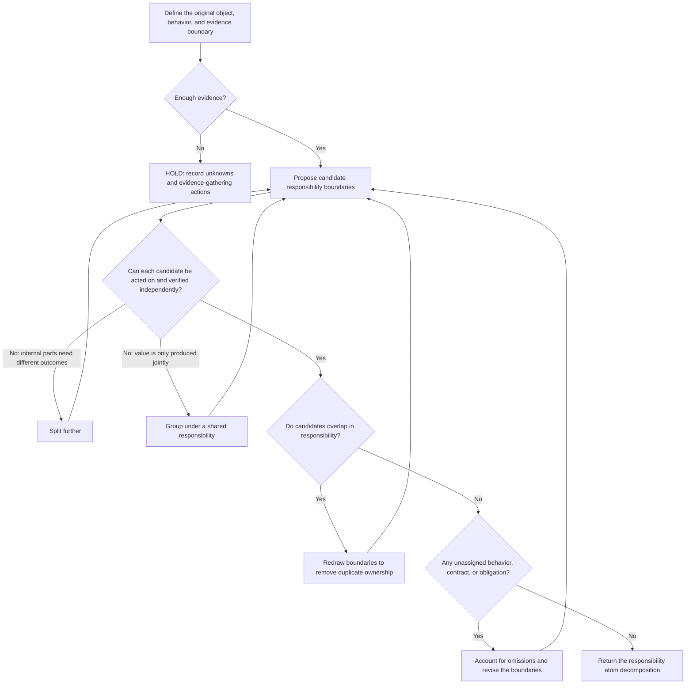

# Responsibility Atom

A responsibility atom is the smallest unit of responsibility whose value can be assessed independently.

It describes an object's externally observable behavioral commitments. Physical structure does not determine responsibility boundaries: one file can contain several atoms, and several files can jointly implement one atom.

## Goal

Produce a complete, non-overlapping decomposition. Every behavior, contract, and retention obligation within the original object's scope must belong to exactly one atom. Each atom must support independent value assessment, disposition, and verification.

Splitting and grouping are steps toward that decomposition. Candidates that cannot be acted on independently must not appear in the final plan.

## Decision process

## Final output

- **Decomposition:** include only established responsibility atoms and demonstrate complete coverage with no overlap.
- **HOLD:** evidence is insufficient for a reliable decomposition; list the unknowns and the actions needed to obtain evidence.

Each atom must specify its responsibility name, observable outcome, consumers, triggers, input contract, output semantics, authoritative source, permissions, lifecycle, disposition boundary, and independent verification method.

The plan must also include two mappings:

1. **Coverage map:** assign every behavior, contract, and retention obligation in the original object to an atom, demonstrating that nothing is missing.
2. **Boundary map:** for each pair of easily confused atoms, specify what each owns and explicitly excludes, demonstrating that responsibilities do not overlap.

Keep revising the boundaries while candidates overlap, omit responsibilities, or cannot be acted on independently. Return `HOLD` when evidence is insufficient.

## Choosing the scale

Parts that produce value, retire, and undergo verification together belong to one atom. Parts that may receive different disposition outcomes belong to different atoms. Every implementation detail must also belong to exactly one atom; no unassigned details may appear in the final plan.

An atom that is too large hides internal differences behind an overall conclusion. An atom that is too small is merely an implementation detail and cannot independently provide value, be acted on, or be verified. Use `HOLD` when evidence is insufficient; avoid forcing a decomposition just to produce a tidy structure.

“Responsibility atom” is an operational definition informed by single responsibility, high cohesion, low coupling, and bounded contexts. It is not an established academic or industry-standard term. It sets the semantic scale of the object being assessed; subsequent value assessment, authorization, and result verification remain separate steps.
