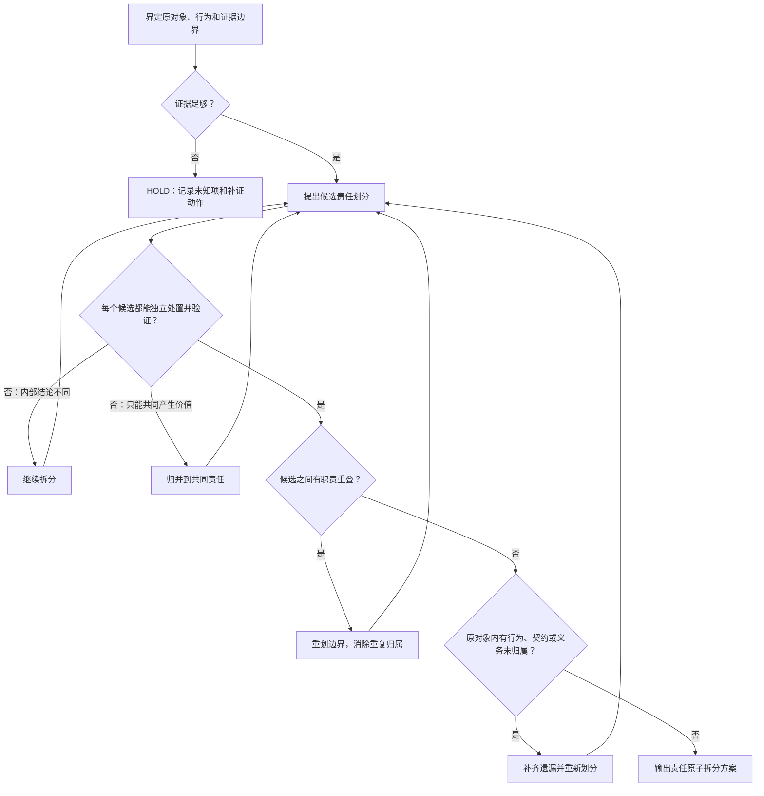

# 责任原子

责任原子（Responsibility Atom）是一个能够被独立判断价值的最小责任单元。

它描述对象对外承担的行为承诺。物理结构不决定责任边界：一个文件可以包含多个责任原子，多个文件也可以共同实现一个责任原子。

## 目标

输出一个不重不漏的拆分方案：原对象范围内的每项行为、契约和保留义务都归属且只归属一个责任原子，每个原子都能独立判断价值、独立处置并独立验证。

拆分和归并是形成方案的过程动作。无法独立处置的候选项不能出现在最终方案中。

## 判定

## 最终输出

- **拆分方案**：只包含已成立的责任原子，并证明它们不重不漏。
- **HOLD**：证据不足，无法形成可靠方案；列出未知项和补证动作。

拆分方案中的每个责任原子必须包含：责任名称、可观察结果、消费者、触发、输入契约、产物语义、Authority、权限、生命周期、处置边界和独立验证方法。

方案还必须包含两张映射：

1. **覆盖映射**：原对象内每项行为、契约和保留义务分别归属哪个责任原子，用于证明没有遗漏。
2. **边界映射**：每对容易混淆的责任原子分别拥有和明确不拥有的内容，用于证明没有重叠。

只要仍有重叠、遗漏或无法独立处置的候选项，就继续重划边界；证据不足时输出 HOLD。

## 尺度原则

一起产生价值、一起退役、一起验证的内容属于同一个责任原子；可能获得不同处置结论的内容属于不同责任原子。所有实现细节也必须归属于且只归属于一个原子，不能作为游离项进入最终方案。

责任原子过大时，整体结论会掩盖内部差异。责任原子过小时，它只是实现细节，无法独立产生价值、处置或验证。证据不足时使用 HOLD，不为获得整齐结构而强行拆分。

“责任原子”是操作性定义，建立在单一职责、高内聚低耦合和 Bounded Context 等思想之上，不是既有学术或行业标准术语。它只确定判断对象的语义尺度，不替代后续的价值判断、处置授权和结果验证。
